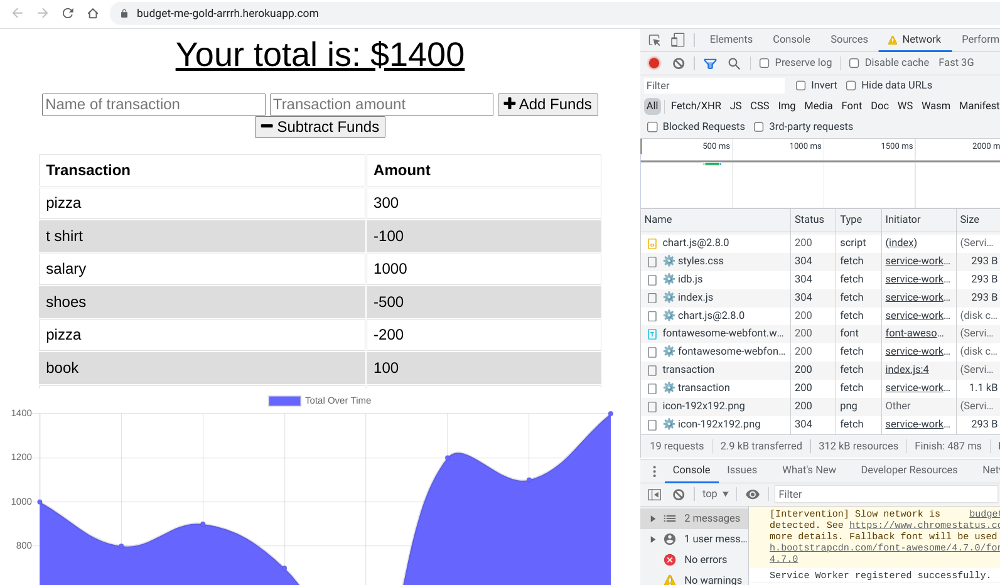

# nerd-talks

## Table of Contents

- [Description](#description)
- [Installation](#installation)
- [Screenshot](#screenshot)
- [Questions](#questions)

## Description

This is a budget tracking site made with mongoDB. It uses service workers and indexedDB to save data that was input while offline.

## Installation

Pre-Requisites

mongodb installed and running

1. Download or clone this repository.
2. On your local machine, open a terminal in the top level directory of the code.
3. On the command line, run npm install to install dependencies.
4. Run npm run start to start the server.

## Screenshot

Here is a screenshot of it working

## Questions

If you have any questions please check out [my github](https://github.com/Naomilounsbury/budget-me-gold-arrrh) Also here is the application deployed on [heroku](https://budget-me-gold-arrrh.herokuapp.com/)
